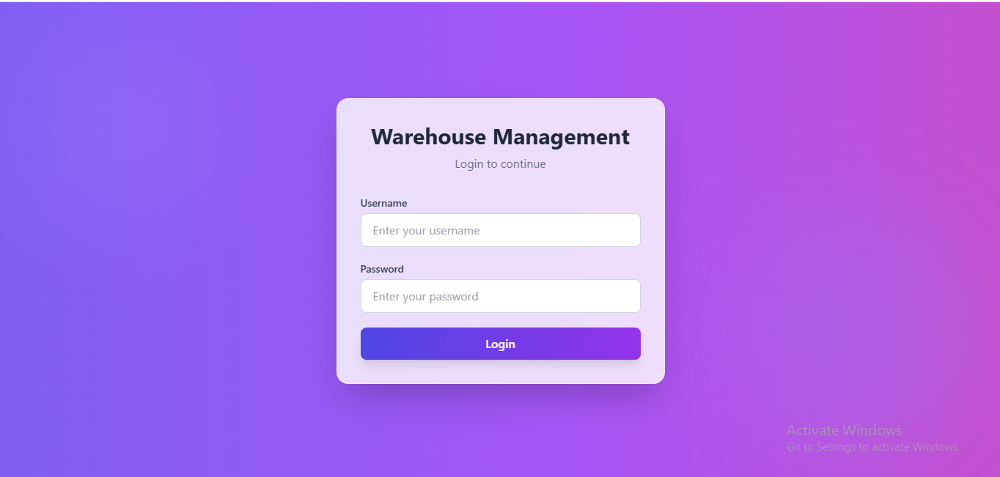
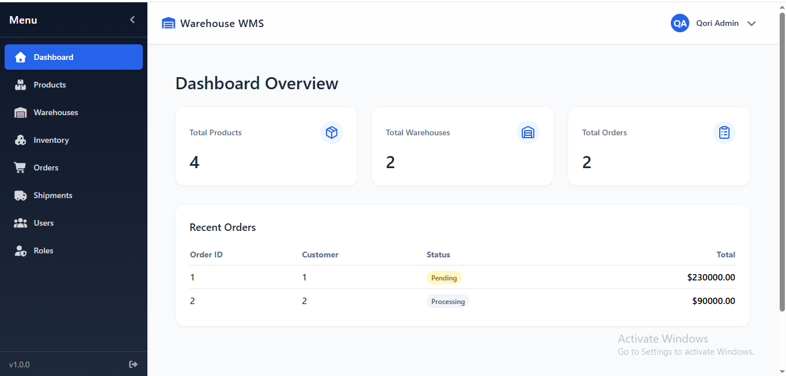
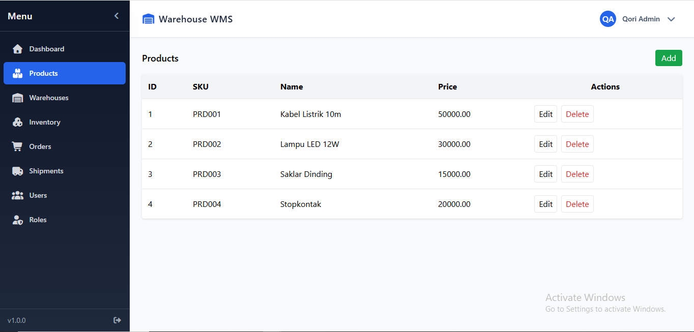
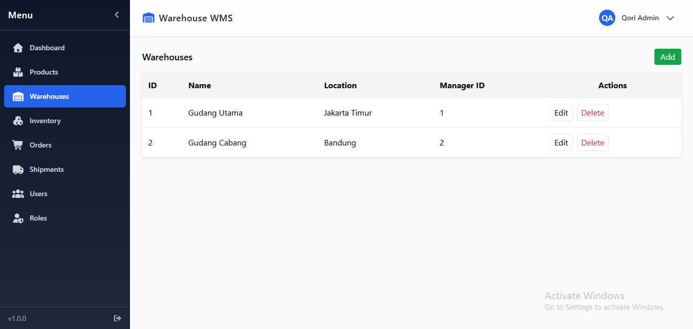
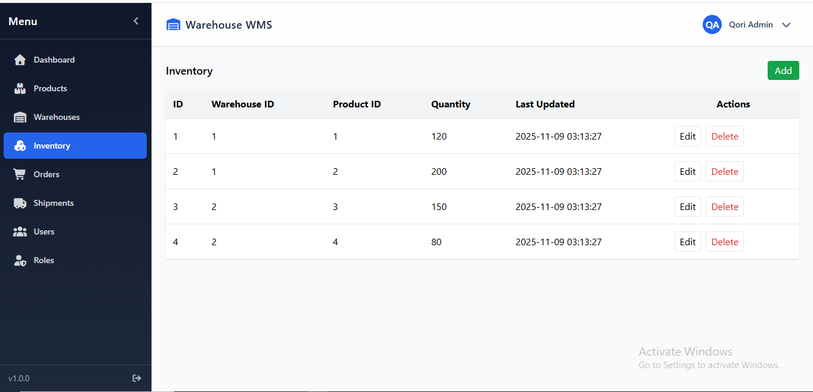
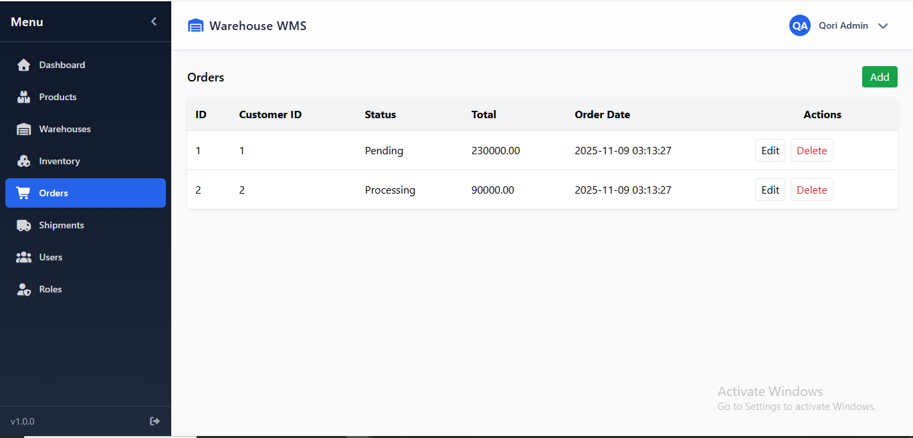
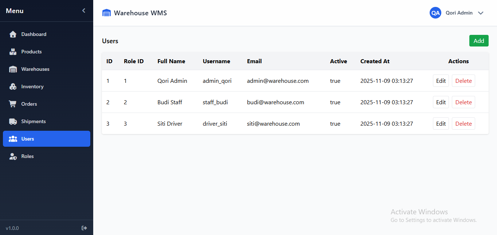
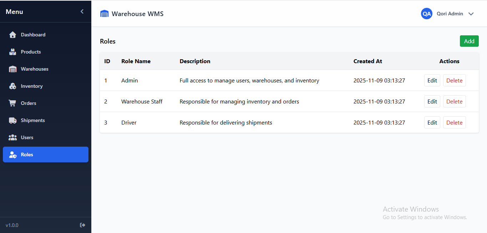

# Warehouse Management System (WMS)

Warehouse Management System (WMS) adalah aplikasi berbasis web yang dirancang untuk membantu perusahaan dalam mengelola kegiatan operasional gudang secara efisien.  
Melalui sistem ini, pengguna dapat memantau dan mengontrol seluruh aktivitas yang berkaitan dengan penyimpanan, pergerakan, dan pengiriman barang secara real-time.

Aplikasi ini dibangun menggunakan **Vite + Vue.js** untuk frontend dan **PHP-CRUD-API** untuk backend, yang memungkinkan integrasi cepat dengan basis data serta menyediakan endpoint API otomatis tanpa perlu menulis kode backend secara manual.

Dengan tampilan antarmuka yang sederhana namun fungsional, sistem ini memudahkan pengguna dalam melakukan proses input, monitoring, dan pelaporan data gudang.

## Fitur Utama

- **Dashboard**: Menampilkan ringkasan data gudang, seperti jumlah produk, stok total, dan aktivitas terbaru.
- **Product Management**: Mengelola data produk termasuk nama, kode, kategori, dan stok.
- **Warehouse Management**: Mengatur lokasi dan kapasitas gudang penyimpanan.
- **Inventory Tracking**: Memantau stok barang masuk dan keluar secara akurat.
- **Order Management**: Mengelola pesanan pelanggan serta status pemenuhan order.
- **Shipment Tracking**: Melacak pengiriman barang dan status logistik.

## Preview

### Login

### Dashboard

### Product Management

### Warehouse Management

### Inventory Tracking

### Order Management

### Shipment Tracking

### User Management

### Role Management

